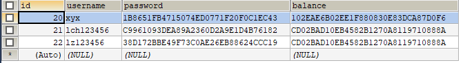
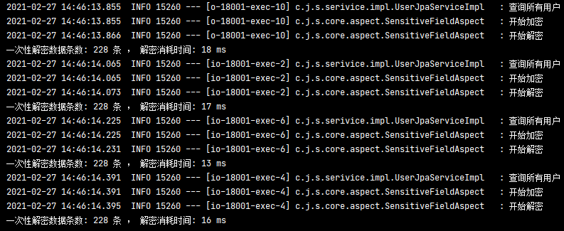

# 字段加解密功能说明

本功能可接入任意springboot项目使用，接入后无需关心加解密逻辑，添加注解即可实现保存到数据库前自动加密数据，从数据库查询返回数据时自动解密。

本功能将默认使用可逆加密算法AES进行加解密，当然各位需要不同的算法可修改[AOP切入处](/sensitive-field-encrypt-core/src/main/java/com/huihe/sensitive/core/aspect/SensitiveFieldAspect.java)的加密和解密执行逻辑。

目前该功能支持针对 JPA 和 Mybatis-Plus 的分页返回数据解密。

demo示例分别展示了项目在接入 JPA 和  Mybatis-Plus 时的方案。

> 主要的业务逻辑代码在 [com.huihe.sensitive.core](/sensitive-field-encrypt-core/src/main/java/com/huihe/sensitive/core) 包下
>
> @SensitiveEntity 添加在实体类上标注此实体类会进行字段的加密扫描。
>
> @SensitiveField 添加到字段上标注此字段需要进行加密解密操作。
>
> @Sensitive 添加到数据访问Dao层，例如：UserMapper、UserRepository，标注针对此接口的方法进行加解密操作。
> 
> 如果实体类上没有添加 @SensitiveEntity 注解将不会对此实体类进行加密扫描，也就是说没有添加 @SensitiveEntity 注解的话，那么 @SensitiveField 是无效的。

application配置说明:

```yaml
# 加解密设置
sensitive:
  key: 你需要的密钥
```

实体类添加注解的示例：

```java
/**
 * 用户类
 *
 * @author Jacques·Fry
 * @version 1.0.0
 * @since 2021/2/1 9:16
 */
@SensitiveEntity
@Table(name = "user")
@Entity
public class User implements Serializable {

    private static final long serialVersionUID = 1L;
    
    @Id
    private int id;

    @ApiModelProperty("用户名")
    private String username;

    @ApiModelProperty("密码")
    @SensitiveField
    private String password;

    @ApiModelProperty("余额")
    @SensitiveField
    private String balance;
}
   
```

数据访问层添加注解示例：

```java
/**
 * 用户访问层
 *
 * @author Jacques·Fry
 * @version 1.0.0
 * @since 2021/2/27 10:22
 */
@Sensitive
@Mapper
public interface UserMapper extends BaseMapper<User> {
    @Override
    List<User> selectList(@Param("ew") Wrapper<User> queryWrapper);

    @Override
    int insert(User entity);

    @Override
    User selectById(Serializable id);

    @Override
    int updateById(User entity);

    @Override
    int update(User entity, @Param("ew") Wrapper<User> updateWrapper);

    @Override
    <E extends IPage<User>> E selectPage(E page, @Param("ew") Wrapper<User> queryWrapper);

}
```


数据库加密结果：



接口访问结果：


解密性能测试：



需了解更多细节详情请下载此示例。